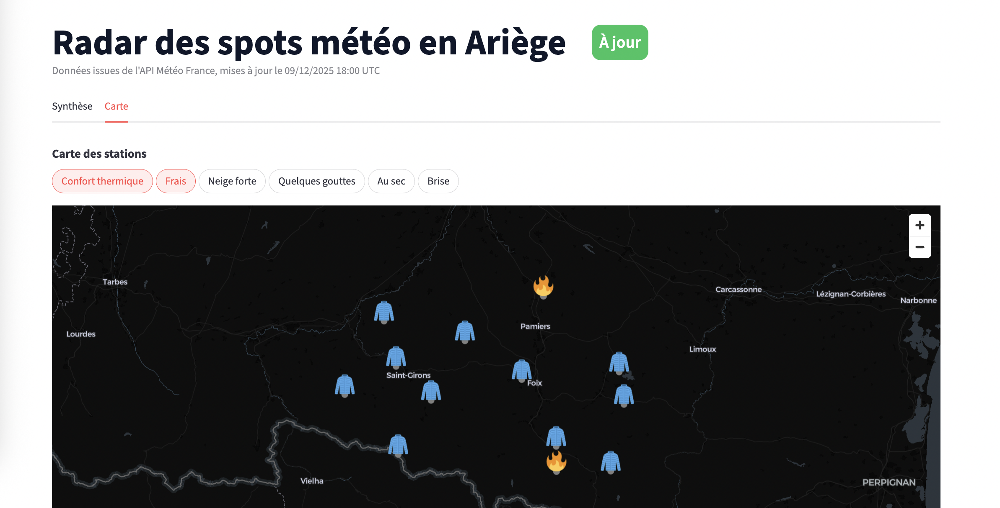

# 📊 Dashboard Streamlit (exposure dbt)

Une fois les données ingérées et les modèles dbt exécutés, on peut explorer les marts via une application Streamlit.

## Prérequis

- Disposer d’un DuckDB rempli par `make dwh-ingest` puis `make dbt-build`
- Variable `DUCKDB_PATH` pointant vers le fichier DuckDB (par défaut `data/warehouse.duckdb`)

## Lancer le dashboard

```bash
make app
# équivalent à : streamlit run apps/bi-streamlit/app.py
```

URL par défaut :
http://localhost:8501


### Fonctionnalités clés

- Badge de fraîcheur (vert/orange/rouge) basé sur la dernière `validity_time_utc`
- Onglet **Synthèse** : cartes de focus listant les spots correspondant aux critères (température, pluie, neige, vent)
- Onglet **Carte** : PyDeck + pills multi-sélection pour afficher les spots par catégorie, avec tooltip (nom, statut, lat/lon)
- Cache Streamlit : données rechargées toutes les 60 s (`st.cache_data(ttl=60)`)

### Data contract

- Source principale : `marts.agg_station_latest_24h`
- Champs critiques : `validity_time_utc`, `station_name`, `latitude`, `longitude`, `temp_24h_c`, `precip_24h_mm`, `snow_24h_m`, `wind_beaufort_label`, `visibility_cat`, `humidity_pct`, flags `is_*`
- Fraîcheur attendue : `validity_time_utc` ≤ 3 h (badge 🟢)

### Badge de fraîcheur — interprétation

- 🟢 « À jour » : dernière `validity_time_utc` ≤ 3 h
- 🟠 « En retard » : entre 3 h et 6 h
- 🔴 « Stale » : > 6 h

Pour rafraîchir manuellement : relancer l’ingestion (`make dwh-ingest DEPT=9`) puis `make dbt-build`. En mode Docker Compose, relancer les services ingest + dbt.

## Exposure dbt associée

Le dashboard est déclaré comme **exposure dbt** (`weather_bi_streamlit`), permettant de :

* cibler uniquement les modèles qui l’alimentent :

    ```bash
    dbt ls -s +exposure:weather_bi_streamlit
    ```

* exécuter uniquement ce périmètre :

    ```bash
    dbt run -s +exposure:weather_bi_streamlit
    dbt test -s +exposure:weather_bi_streamlit
    ```

## Aperçu visuel

### Fraîcheur à jour vs en retard

- Badge « À jour » quand les données sont fraîchement ingérées
- Badge « En retard » quand la fraîcheur est insuffisante :  
  

### Cartes de focus

- Vue « Synthèse » avec les cartes listant les spots répondant aux critères (température, pluie, neige, vent) :  
  


### Carte interactive

- Vue « Carte » montrant les spots filtrés sur la carte (sélection multi-onglets via les pills) :  
  

