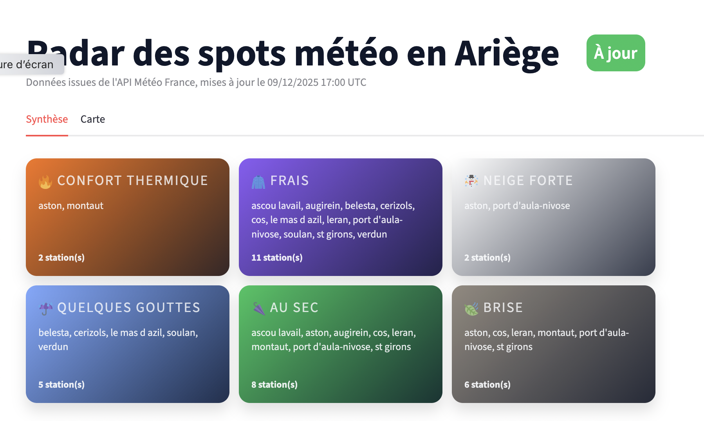
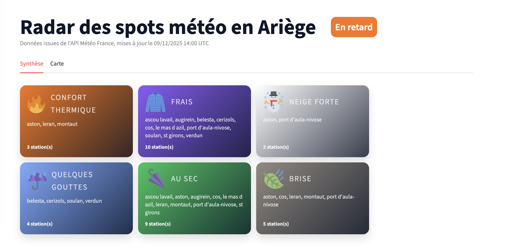
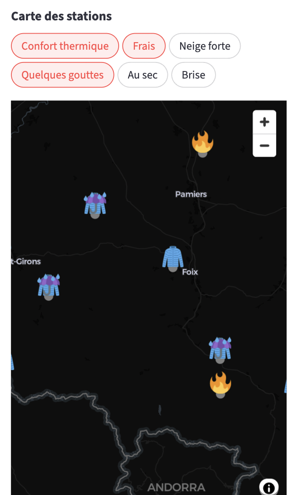
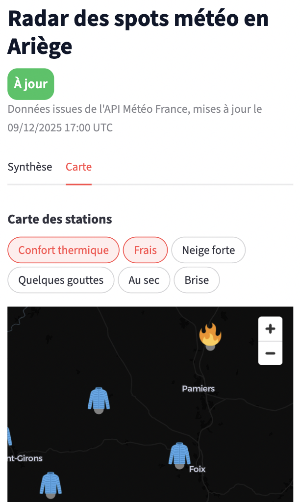

# 📊 Dashboard Streamlit (exposure dbt)

Une fois les données ingérées et les modèles dbt exécutés, on peut explorer les marts via une application Streamlit.

## Lancer le dashboard

```bash
streamlit run apps/bi-streamlit/app.py
```

URL par défaut :
http://localhost:8501

Ce dashboard s'appuie principalement sur le modèle `agg_station_latest_24h`.

## Exposure dbt associée

Le dashboard est déclaré comme **exposure dbt** (`weather_bi_streamlit`), permettant de :

* cibler uniquement les modèles qui l’alimentent :

    ```bash
    dbt ls -s +exposure:weather_bi_streamlit
    ```

* exécuter uniquement ce périmètre :

    ```bash
    dbt run -s +exposure:weather_bi_streamlit
    dbt test -s +exposure:weather_bi_streamlit
    ```

## Aperçu visuel

### Desktop — fraîcheur à jour vs en retard

- Badge « À jour » quand les données sont fraîchement ingérées :  
  
- Badge « En retard » quand la fraîcheur est insuffisante :  
  

### Mobile — cartes de focus

- Vue « Synthèse » en mobile avec les cartes listant les spots répondant aux critères (température, pluie, neige, vent) :  
  

### Mobile — carte interactive

- Vue « Carte » montrant les spots filtrés sur la carte (sélection multi-onglets via les pills) :  
  
- Zoom mobile alternatif sur la carte (autre capture) :  
  
