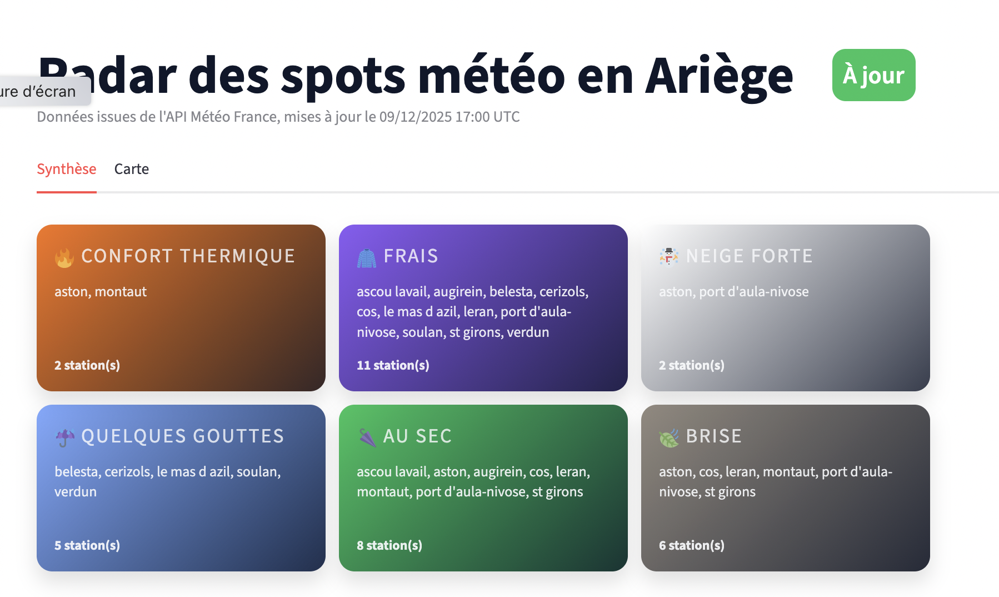
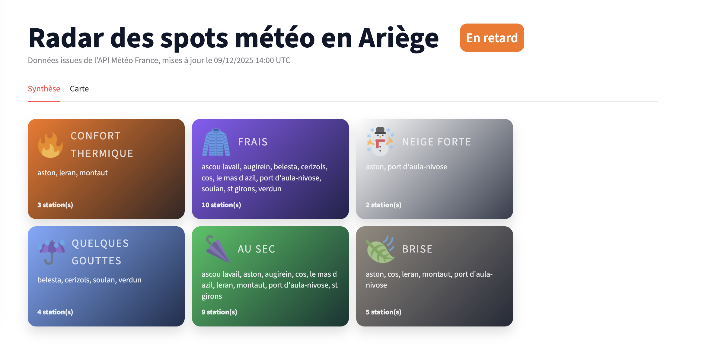
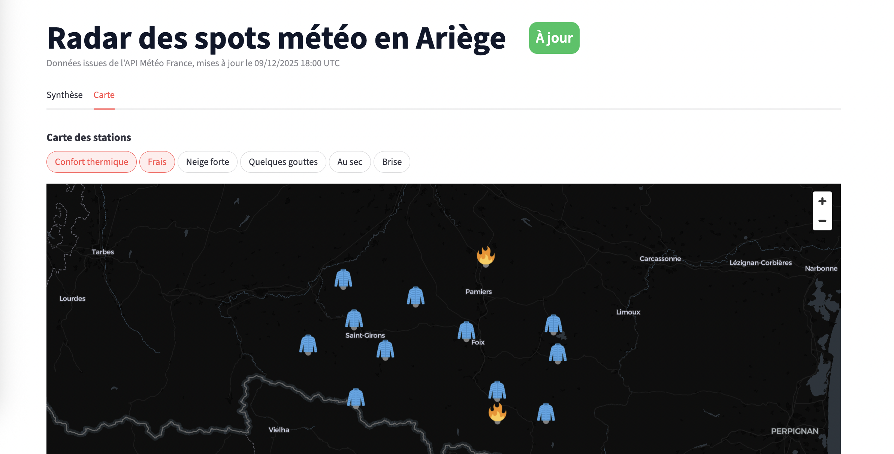

# Dashboard

The Streamlit dashboard is the primary consumer of the analytics layer.

---

## Purpose

- Real-time view of weather conditions per station
- Rankings, summaries, and map exploration

---

## Data Source

- `marts.agg_station_latest`

All aggregations and business logic are computed upstream in dbt.

---

## Data Freshness

- Fresh: ≤ 3 hours
- Delayed: 3–6 hours
- Stale: > 6 hours

---

## Visual Overview

### Summary view

### Delayed data example

### Map view

