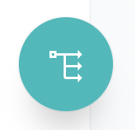
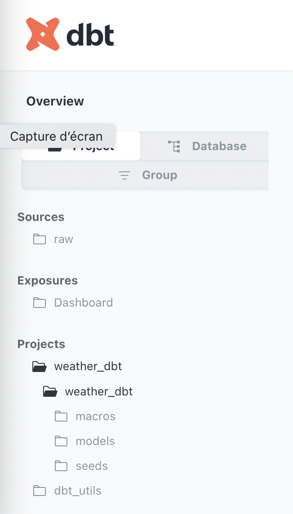
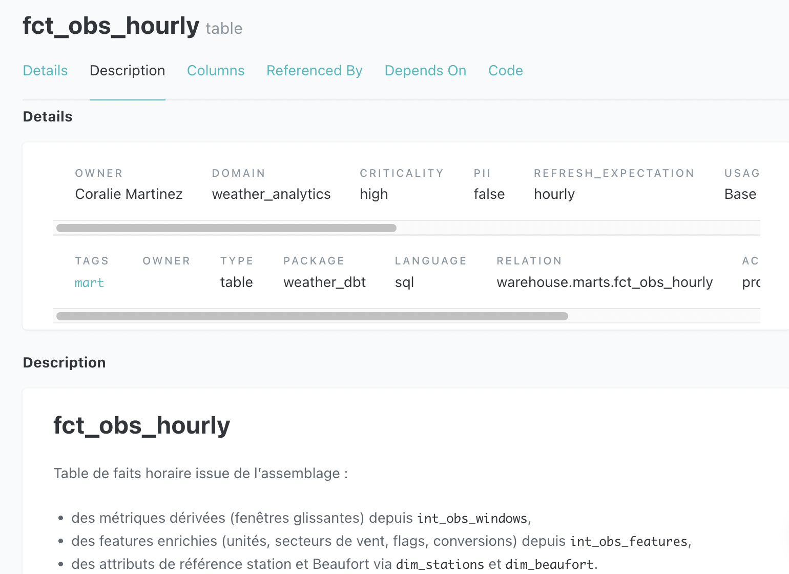
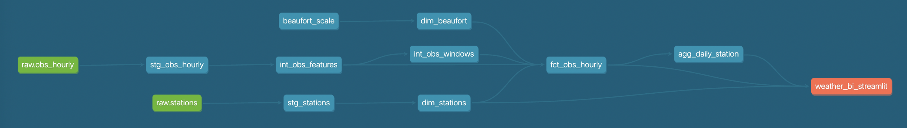

# 📚 Documentation dbt

Après exécution des modèles (`make dbt-build` ou `make dbt-rebuild`), il est possible de générer et d’explorer la documentation dbt, qui reflète l’ensemble des **modèles**, **sources**, **tests** et le **graph de lineage** du projet.

---

## Générer la documentation

```bash
make dbt-docs-generate
```

Cette commande génère les fichiers HTML/JSON de documentation dans le dossier `target/`.

---

## Servir la documentation en local

```bash
make dbt-docs-serve
```

Ensuite, ouvrir le navigateur sur :

* [http://localhost:8080](http://localhost:8080)

L’interface dbt Docs permet notamment de consulter :

* la liste des **sources** et des **modèles** (`staging`, `intermediate`, `marts`) ;
* les **descriptions de tables et de colonnes** définies dans les fichiers YAML ;
* les **tests** associés (unique, not null, accepted values, etc.) ;
* le **graph de lineage** permettant de visualiser le flux `raw → staging → intermediate → marts`.

Le lineage est accessible via le bouton « Lineage » en bas à droite du panneau dbt Docs : 

---

## Aperçu de la documentation dbt

### Navigation dans dbt Docs

L’interface permet d’explorer facilement l’ensemble des modèles, sources, tests et descriptions.



### Fiche d’un modèle analytique (`fct_obs_hourly`)

Chaque modèle documenté expose sa description, ses colonnes, ses contraintes et ses tests associés.



### Lineage complet (`raw → staging → intermediate → marts`)

Le lineage graph permet de visualiser le flux de transformation de bout en bout, jusqu’à la consommation BI.

