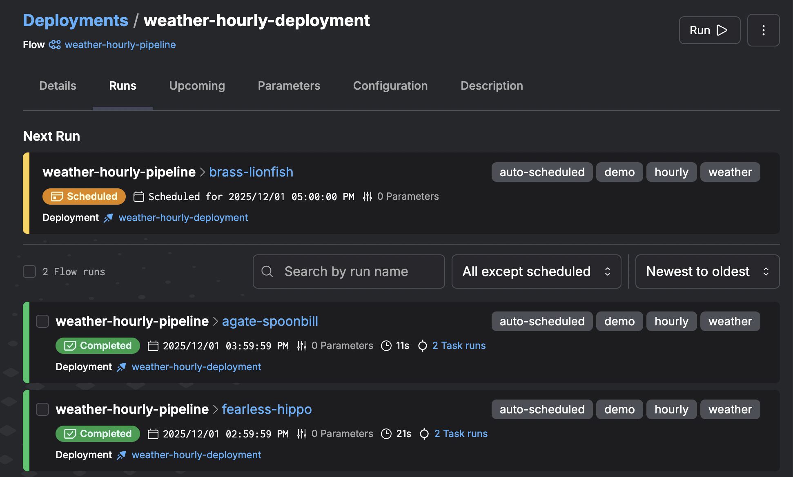

# ⚙️ Orchestration Prefect (horaire)

Ce projet utilise **Prefect 3** pour orchestrer **localement** le pipeline
ingestion → dbt → DuckDB.

L’objectif n’est pas de proposer un pipeline 24/7 en production, mais de montrer
comment brancher un orchestrateur moderne autour d’un projet dbt existant.

---

## 1. Vue d’ensemble

L’orchestration repose sur le script :

```text
orchestration/flow_prefect.py
```

Il définit un flow Prefect :

* `weather_hourly_pipeline` qui :

  * lance l’ingestion des données Météo-France via `make dwh-ingest DEPT=<code>`,
  * exécute `dbt` (`dbt deps` puis `dbt build`) sur le projet `weather_dbt`,
* et un **deployment Prefect** associé à un **schedule cron horaire** (`0 * * * *`).

Tant que :

* le serveur Prefect est démarré (`prefect server start`),
* et que le process de service du flow tourne,

le pipeline est exécuté automatiquement selon ce schedule et le warehouse DuckDB
(`data/warehouse.duckdb`) est régulièrement rafraîchi.

---

## 2. Modes d’exécution du flow

Le script supporte deux modes principaux via l’argument `--mode` :

### 2.1. Mode `run` (exécution ponctuelle)

Exécute le flow **une seule fois**, sans deployment ni schedule.

```bash
source .venv/bin/activate
export DBT_PROFILES_DIR=./profiles

python orchestration/flow_prefect.py --mode run --dept 9
```

Ce mode est utile pour :

* tester le flow Prefect,
* rejouer le pipeline de bout en bout de manière manuelle.

### 2.2. Mode `serve` (deployment + schedule horaire)

Crée (ou met à jour) un **deployment** Prefect pour `weather_hourly_pipeline`,
avec un **schedule horaire**, puis démarre un process long qui exécute les runs
planifiés tant qu’il reste actif.

```bash
python orchestration/flow_prefect.py --mode serve --dept 9
```

---

## 3. Démarrer l’orchestration locale pas à pas

### 3.1. Lancer le serveur Prefect

Dans un premier terminal :

```bash
prefect server start
```

* UI disponible sur : [http://127.0.0.1:4200](http://127.0.0.1:4200)
* Le serveur stocke les flows, deployments, schedules et historique des runs.

### 3.2. Configurer l’URL de l’API Prefect

Dans un second terminal :

```bash
prefect config set PREFECT_API_URL=http://127.0.0.1:4200/api
```

Puis activer l’environnement pour le projet :

```bash
source .venv/bin/activate
export DBT_PROFILES_DIR=./profiles
```

### 3.3. Démarrer le flow en mode `serve`

Toujours dans ce second terminal :

```bash
python orchestration/flow_prefect.py --mode serve --dept 9
```

Ce mode :

* enregistre un **deployment** (par exemple `weather-hourly-deployment`)
  dans l’UI Prefect,
* lui associe un **schedule cron horaire** (`0 * * * *`),
* exécute automatiquement le pipeline selon ce schedule tant que le process
  `serve` reste actif.

---

## 4. Ce que l’on voit dans l’UI Prefect

Dans l’UI Prefect ([http://127.0.0.1:4200](http://127.0.0.1:4200)) :

* **Flows**

  * `weather_hourly_pipeline` apparaît comme flow du projet.
* **Deployments**

  * un deployment lié au flow
* **Flow Runs**

  * chaque exécution du pipeline (qu’elle soit déclenchée en `run`
    ou par le schedule en `serve`),
  * détail des tasks (ingestion, dbt), logs, états (Success / Failed).

### Exemple de vue des runs horaires

L’interface permet par exemple de visualiser le prochain run planifié ainsi que
l’historique des runs automatiques pour le déploiement `weather_hourly_pipeline` :


